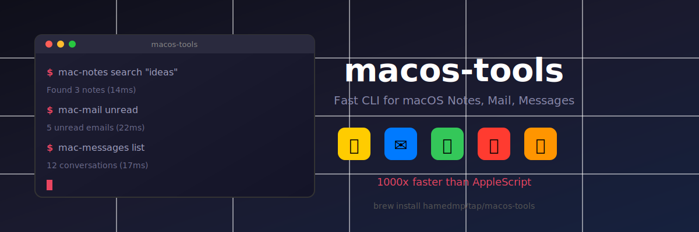

# macos-tools

<p align="center">
  
</p>

<p align="center">
  <a href="https://github.com/HamedMP/macos-tools/stargazers"></a>
  <a href="https://github.com/HamedMP/macos-tools/releases"></a>
  <a href="https://github.com/HamedMP/macos-tools/blob/main/LICENSE"></a>
  
  
  
</p>

<p align="center">
  <strong>Fast CLI tools for macOS Calendar, Notes, Mail, Messages, and more.</strong><br>
  Direct database access - 1000x faster than AppleScript.
</p>

<p align="center">
  <a href="#installation">Installation</a> |
  <a href="#cli-tools">CLI Tools</a> |
  <a href="#claude-code-plugin">Plugin</a> |
  <a href="#productivity-commands">Productivity</a>
</p>

## Installation

### Homebrew (Recommended)

```bash
brew install hamedmp/tap/macos-tools
```

### From Source

```bash
git clone https://github.com/hamedmp/macos-tools.git
cd macos-tools
swift build -c release
sudo cp .build/release/mac-* /usr/local/bin/
```

## CLI Tools

| Tool | Description | Performance |
|------|-------------|-------------|
| `mac-calendar` | Query Calendar events | 15ms |
| `mac-notes` | Search Apple Notes | 14ms |
| `mac-messages` | Search iMessages | 17ms |
| `mac-mail` | Search Apple Mail | 22ms |
| `mac-contacts` | Search Contacts | - |
| `mac-focus` | Focus mode control | - |
| `mac-music` | Apple Music / Spotify | - |
| `mac-canvas` | Interactive markdown viewer | - |

### Calendar

```bash
mac-calendar                   # Today's events
mac-calendar tomorrow          # Tomorrow's events
mac-calendar week              # Next 7 days
mac-calendar month             # Next 30 days
mac-calendar --json            # Output as JSON
```

### Notes

```bash
mac-notes                      # List recent notes
mac-notes search "meeting"     # Search notes
mac-notes create "Title"       # Create new note
mac-notes create "Title" -b "Body content"  # With body
mac-notes folders              # List folders
mac-notes export               # Export to markdown
```

### Messages

```bash
mac-messages                   # Recent conversations
mac-messages search "hello"    # Search messages
mac-messages history +1234     # Chat history with contact
mac-messages send +1234 "Hi"   # Send message (with confirmation)
```

### Mail

```bash
mac-mail                       # Recent emails
mac-mail unread                # Unread only
mac-mail search "invoice"      # Search emails
mac-mail from "john@"          # From specific sender
mac-mail attachments           # Emails with attachments
```

### Other Tools

```bash
mac-contacts search John       # Search contacts
mac-focus                      # Focus mode status
mac-music                      # Now playing
mac-music play/pause/next      # Control playback
```

### Canvas (Interactive Viewer)

`mac-canvas` provides a rich, interactive viewer for Claude Code outputs. It displays markdown content with live updates and supports two modes:

#### TUI Mode (Terminal)

Best for: Pre-opened in a separate terminal window. Updates appear instantly as Claude writes to canvas.

```bash
# Open in a separate terminal BEFORE using Claude commands
mac-canvas watch
```

Features:
- Sidebar showing all canvas sessions
- Live content updates
- Full keyboard navigation
- Actions: copy, save to Notes, email

Keyboard shortcuts:
| Key | Action |
|-----|--------|
| `j/k` or `↑/↓` | Scroll up/down |
| `g/G` | Go to top/bottom |
| `Tab` | Jump to next section |
| `[` | Focus sidebar |
| `]` | Focus content |
| `Enter` | Open selected canvas (sidebar) |
| `c` | Copy current section |
| `C` | Copy all content |
| `s` | Save to Apple Notes |
| `e` | Compose email |
| `o` | Open file in default app |
| `/` | Search |
| `?` | Show help |
| `q` | Quit |

#### GUI Mode (Native Window)

Best for: Auto-launched by Claude commands. Opens automatically when content is written to canvas.

```bash
mac-canvas watch --gui         # Manual launch
```

The GUI launches automatically via PostToolUse hook when commands like `/mac:calendar`, `/mac:briefing`, `/mac:mail` write to `~/.claude/canvas/`.

Features:
- Native macOS window with WebKit rendering
- Sidebar with all sessions
- Action bar: Copy, Save to Notes, Email, Open
- Auto-selects newest canvas
- Remembers window position

#### Usage with Claude Code

All data commands (`/mac:mail`, `/mac:calendar`, `/mac:briefing`, etc.) write to canvas by default:

1. **Automatic (recommended)**: Just run commands - GUI opens automatically
   ```
   /mac:briefing
   ```

2. **Pre-opened TUI**: Open `mac-canvas watch` in another terminal first, then run commands

3. **Disable canvas**: Add `--no-canvas` flag
   ```
   /mac:mail --no-canvas
   ```

## Claude Code Plugin

Install the plugin to use `/mac:*` commands in Claude Code.

**Option 1: Via `/plugin` command (recommended)**
```
/plugin marketplace add hamedmp/macos-tools
/plugin install mac@claude-macos-tools
```

**Option 2: Via CLI**
```bash
claude plugin marketplace add hamedmp/macos-tools
claude plugin install mac@claude-macos-tools
```

### Basic Commands

```
/mac:setup           Check if CLI tools installed
/mac:calendar        Today's events
/mac:notes           Recent notes
/mac:notes:search    Search notes
/mac:notes:create    Create a new note
/mac:messages        Recent conversations
/mac:messages:search Search messages
/mac:mail            Recent emails
/mac:mail:unread     Unread emails
/mac:contacts        Search contacts
```

### Productivity Commands

```
/mac:config          Configure which sources to include
/mac:daily           Today's overview (calendar + mail + messages)
/mac:briefing        AI summary with action items
/mac:weekly          Weekly overview with insights
/mac:todo:view       View todos from Notes
/mac:todo:add        Add todo to Notes
```

#### `/mac:briefing` - AI Daily Summary

Default behavior - summarizes your day:
```
/mac:briefing
```
- Unread emails
- Today's calendar
- Recent messages

Focus on specific topic:
```
/mac:briefing receipts        # Everything about receipts
/mac:briefing "project alpha" # Project-specific summary
```

Output includes:
- Executive summary
- Action items
- Key deadlines
- People to follow up with

## Permissions

Grant **Full Disk Access** for Messages and Mail:

**System Settings > Privacy & Security > Full Disk Access > Add your terminal**

Grant **Calendar Access** for mac-calendar (prompted automatically on first use).

## Requirements

- macOS 13.0+ (Ventura)
- Swift 5.9+
- Full Disk Access (for Messages/Mail)

## License

MIT
